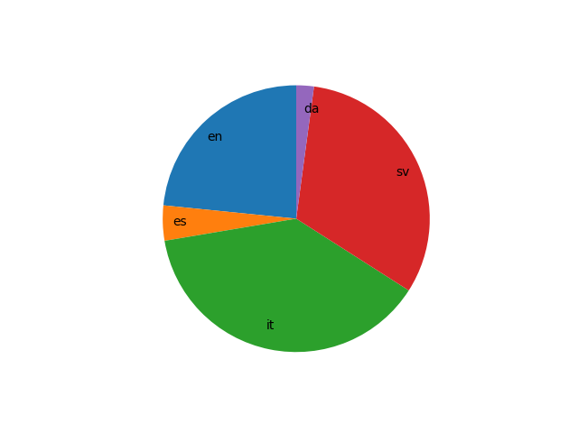

1. Javier Marías, _Mañana en la batalla piensa en mí_: interesante la parte introspectiva 
2. Neil Gaiman and Colleen Doran, _Neil Gaiman's Chivalry_: thoroughly enjoyed on an e-reader but it probably deserves color
3. Ilaria Ferramosca e Chiara Abastanotti, _Lea Garofalo. Una madre contro la 'ndrangheta_: fumetto biografico molto ben disegnato, edizione purtroppo non curatissima 
4. Zerocalcare, _Kobane calling. Oggi_: rilettura propedeutica al nuovo libro
5. Zerocalcare, _No sleep till Shengal_: decisamente all'altezza di Kobane Calling
6. Massimiliano Bucchi, _Natale di scienza. Storie di scoperte e di stupore_: libricino ricco di aneddoti preziosi, letto purtroppo un po' in ritardo sul Natale
7. Karin Boye, _Kallocain_: ännu bättre än 1984
8. Karin Boye, _Ur funktion_: ny favorit novellsamling
9. Seanan McGuire, _Every heart a doorway_: not my thing
10. Melanie Gillman, _Other ever afters_: turns out queer fairy tales can be problematic too
11. Padraic O'Farrell, _Ancient Irish legends_: amusing legends but the storytelling is quite poor
12. Ejnar Fors Bergström, _Den faröiska boken_: intressant men förutsätter goda kunskaper i 4 olika nordiska språk
13. Angela & Luciana Giussani, Giuseppe Palumbo e un altro paio di disegnatori, _Diabolik #1. Il re del terrore: il remake_: la storia è sempre quella ma i disegni di Palumbo sono sempre belli
14. James Hayton, _PhD_: should have been left on the byteshylla
15. Tommaso Avati, _Il silenzio del mondo_: discreto romanzo su tre generazioni di donne sorde
16. Luigi Ghirri, _Lezioni di fotografia_: anche se il testo non nasce per la pubblicazione, il risultato é un libro di grande ispirazione
17. Valentino Zeichen, _Poesie_: per la maggior parte brevi, razionali, ironiche, iconiche e poco metriche
18. Eugenia Cheng, _x + y_: part 1 resonated a lot with me, part 2 made me angry
19. Maia Kobabe, _Gender queer: a memoir_: 4th read, still great 
20. Astrid Lindgren, _Ronja Rövardotter_: ganska intensiv barnbok med riktigt vackra illustrationer
21. Anneli Furmark, _Gå med mig till hörnet_: ännu bättre på svenska
22. Eshkol Nevo, _La simmetria dei desideri_: finalmente un romanzo abbastanza appassionante da perderci il sonno!
23. Jane Nysted, _Språkbitar_: perfekt frukostbok
24. Roberto Mercadini, _La donna che rise di Dio_: aneddoti biblici divertenti, ma Mercadini lo preferisco come oratore
25. Ezio Noto, _La leggenda di Flauto. L'uomo che inventò le frecce fischianti_: sembra scritto da un bambino che ha appena imparato cos'è il mito
26. Jorge Luis Borges, _La biblioteca de Babel: cuentos selectos y un poema_: pequeña hermosa antología alemana que finalmente me introdujo a Borges
27. Olga Ravn, _De ansatte_: ganska stolt över att ha läst denna danska bok med bara mina kunskaper i svenska, men en översättning hade kanske varit mer engagerande
28. Anneli Furmark, _August & jag_: stilig seriebok, men jag antar att jag är för Strindbergokunnig
29. Umberto Eco, _Il fascismo eterno_: mi ha aiutata a capire meglio l'origine dell'uso corrente del termine "fascismo", però non mi ha convinta al 100%
30. Tove Jansson, _Stenåkern_: kort roman som verkade väldigt lovande men egentligen bara okej
31. Seneca, _La vita felice_: preferisco di gran lunga le lettere a Lucilio
32. Zeina Abirached, _Svalornas lek_: påminner lite om Marjane Satrapis _Persepolis_. Mindre självironisk men grafiskt väldigt lockande
33. Marjane Satrapi, _Kyckling med plommon_: inte så mycket att säga, Marjane Satrapi är en riktig seriemästare
34. Ian Watson, _The embedding_: utterly disappointing like most fantalinguistics
35. Lisa Wool-Rim Sjöblom, _Den uppgrävda jorden_: ett bra exempel på att tecknade serier är ett bra medium för journalistik, även om just denna inte var min favorit
36. Melanie Gillman, _As the crow flies_: better than _Other ever afters_, but I'm pretty sure the student (Maia Kobabe) surpassed the master here
37. Elaf Ali, _Vem har sagt något om kärlek?_ (lättläst version): grupphögläsning på grannskapsbiblioteket med [Vuxna i lärande](https://goteborg.se/wps/portal/enhetssida/vuxna-i-larande-). Ganska klokt textval för kontexten, tycker jag
38. Tove Jansson, _Vem ska trösta knyttet?_: knyttet och skruttet påminner mig lite om mina egna karaktärer, il boblo e la smacciolina
39. Pier Paolo Pasolini, _Il fascismo degli antifascisti_: estremamente scoraggiante
40. Walter Moers, _The city of the dreaming books_: it's a bit like if Douglas Adams had written a novel after graduating from Hogwarts
41. Velimir Chlebnikov, _47 poesie facili e una difficile_: direi piú 47 poesie difficili e forse massimo una facile, che é poi quella di cui avevo giá parlato [qui](/home/harisont/Repos/harisont/harisont.github.io/_posts/2022-03-29-meaningful-media.md#2-un-bellissimo-video-di-roberto-mercadini-sul-poeta-russo-velimir-chlebnikov-it--sv) 
42. Daniel Ahlgren, _För fin för denna världen_: som Zerocalcare sade i en intervju är tecknade serier inte nödvändigtvis lättare att läsa än "riktiga" böcker
43. Mark Twain, _Die schreckliche deutsche Sprache_ (parallel English-German edition): unlike fantalinguistics, language satire is always fun
44. Gianni Rodari, _Il libro degli errori_: il mio preferito da bambina, ma i brani in versi non mi hanno altrettanto convinta da adulta
45. Tove Jansson, _Trollvintern_: ganska mysigt att läsa högt med en vän en vinterkväll
46. Giuseppe Berto, _Il male oscuro_: prosa notevole e grande abilità nel mostrare l'ironia della tragedia 
47. Carola Frediani, Sonia Montegiove e Federico Nejrotti, _Generazione AI - una monografia sull'intelligenza artificiale_: apprezzo molto [Guerre di Rete](https://www.guerredirete.it/), ma questo ebook l'ho trovato così così.